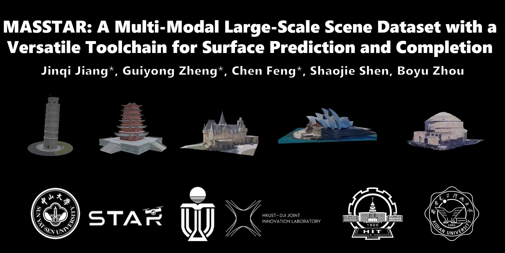
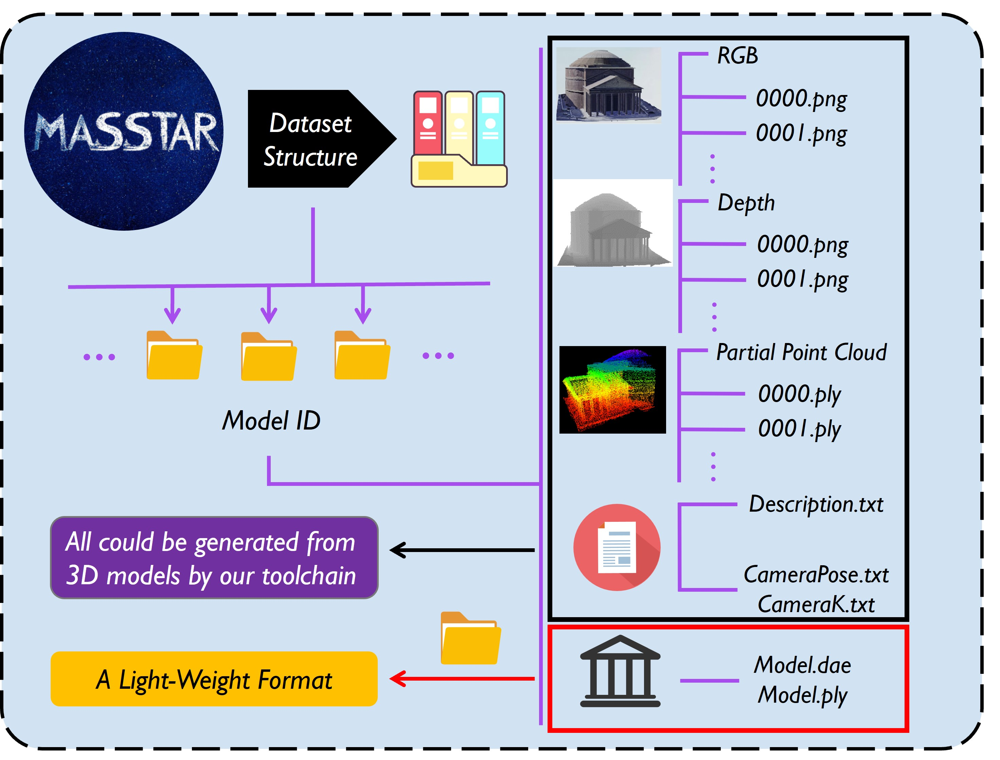

# MASSTAR 

## Introduction

**[Submitted to ICRA'24]** This repository maintains the implementation of "MASSTAR: A Multi-Modal Large-Scale Scene Dataset with a Versatile Toolchain for Surface Prediction and Completion".

**Complete video**: [Bilibili](https://www.bilibili.com/video/BV1fy4y1F7Z6/?spm_id_from=333.999.0.0&vd_source=7d9ba13550e9ec24b6bf69d5c3ff3), [Youtube](https://www.youtube.com/watch?v=jjPPIAAkPrk)

**Authors**: Jinqi Jiang* , Guiyong Zheng*, [Chen Feng*](https://chen-albert-feng.github.io/AlbertFeng.github.io/), [Shaojie Shen](https://uav.hkust.edu.hk/group/), and [Boyu Zhou](http://sysu-star.com/).

**Institutions**: [SYSU STAR Group](http://sysu-star.com/), [HKUST Aerial Robotics Group](https://uav.hkust.edu.hk/), [HIT](http://www.hit.edu.cn/) and [XDU](https://www.xidian.edu.cn/).

## Dataset

### Dataset Structure

### Dataset Download

*Download link*: stored in [Zenodo](https://zenodo.org/record/8416679)

## ToolChain

**Code will come soon**
